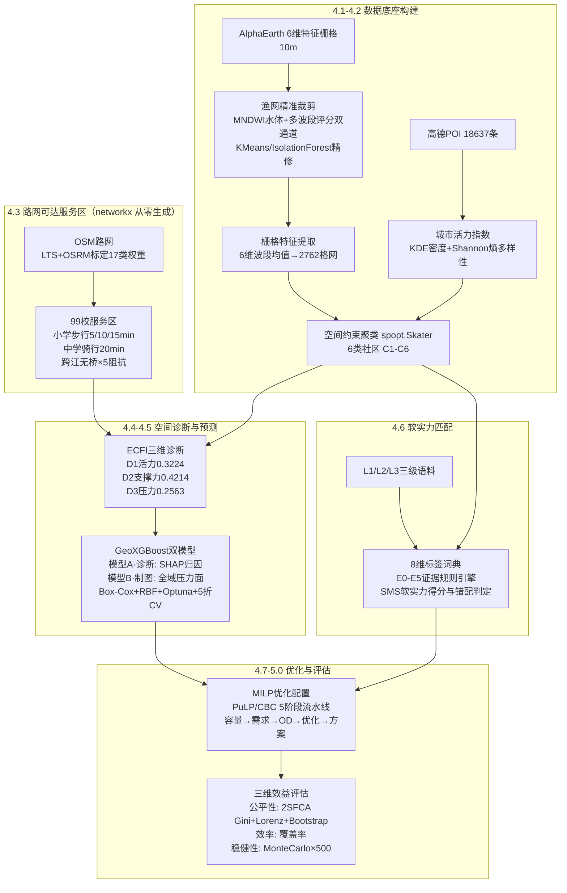

# 基于 AlphaEarth 地理大模型与 GeoAI 的义务教育资源空间诊断与均衡优化研究

**——以赣州市章贡区为例**

[](https://www.python.org/)
[]()
[](./LICENSE)

> **一句话概括**：以 AlphaEarth 地理大模型 6 维特征为底座，融合空间约束聚类、路网可达服务区、ECFI 三维诊断、GeoXGBoost 双模型压力预测与 MILP 优化配置，构建"诊断 → 预测 → 优化 → 评估"全链路、**纯开源 Python** 可复现的 GeoAI 框架，为义务教育资源均衡配置提供可迁移的空间决策方案。

**English one-liner**: A full-chain, pure-Python GeoAI framework — built on AlphaEarth foundation-model features — that diagnoses, predicts, optimizes, and evaluates the spatial equity of compulsory-education resources, demonstrated on 99 schools in Zhanggong District, Ganzhou, China.

---

## 目录

- [研究区与数据概览](#研究区与数据概览)
- [技术路线](#技术路线)
- [核心亮点](#核心亮点)
- [快速开始](#快速开始)
- [仓库结构](#仓库结构)
- [成果展示](#成果展示)
- [文档](#文档)
- [引用方式](#引用方式)
- [致谢](#致谢)
- [License](#license)

---

## 研究区与数据概览

| 项目 | 内容 |
|------|------|
| 研究区 | 江西省赣州市章贡区（427.8 km²） |
| 学校 | 99 所基础教育学校（小学 53 / 初中 36 / 高中 10） |
| 分析单元 | 250 m × 250 m 渔网格网，共 2762 个 |
| 坐标系 | EPSG:4526（CGCS2000 / 3-degree Gauss-Kruger zone 38，中央经线 114°E） |
| 运行环境 | Python 3.11+，纯开源栈（geopandas / scikit-learn / XGBoost / PuLP / spopt / networkx 等） |

**数据来源**（详见 [data/README.md](./data/README.md)，大数据不入库）：

- **AlphaEarth 地理大模型 6 维特征栅格**（10 m）：Decay_Index、Building_Density、Road_Density、Texture_Complexity、LandUse_Mix、Green_Coverage
- **高德 POI** 18,637 条（城市活力计算）
- **WorldPop** 人口栅格
- **OSM 路网**（LTS 分级 + OSRM 本地化标定的 17 类道路权重）
- **学校语料**：L1 学校自述文本 / L2 媒体报道 / L3 教育局公示（软实力标签体系）

> 全流程不依赖任何商业 GIS 软件：空间约束聚类用 `spopt.Skater`、路网服务区用 `networkx` 有向最短路从零实现，所有步骤均可在普通 Python 虚拟环境中端到端运行。

---

## 技术路线



全链路已编排为 **14 步纯 Python CLI 流水线**（格式转换 → 归一化 → 渔网裁剪 → 特征提取 → 活力指数 → 空间约束聚类 → 路网预处理 → 小学/中学服务区 → ECFI 诊断 → GeoXGBoost 双模型 → SMS 软实力 → MILP 优化 → 效益评估），并提供一键编排器，见 [examples/run_pipeline.py](./examples/run_pipeline.py)。

```bash
python examples/run_pipeline.py --list   # 查看全部 14 步、顺序与上游依赖
```

---

## 核心亮点

1. **AlphaEarth 大模型 6 维特征底座** —— 以 Decay_Index、建筑密度、路网密度、纹理复杂度、土地利用混合度、植被覆盖 6 个 10 m 特征波段贯穿"渔网裁剪 → 聚类 → 诊断 → 预测"全流程，替代传统遥感指数体系。

2. **GeoXGBoost 双模型架构** —— 模型 A（诊断模型）在学校点做 SHAP 归因解释学位压力成因；模型 B（制图模型）格网直推生成全域连续压力面；以 Spearman 秩相关做双模型空间认知一致性检验，兼顾"解释力"与"制图力"。

3. **ECFI 三维教育压力指数** —— 服务区尺度上融合 D1 活力 / D2 支撑力 / D3 压力三个空间代理维度（熵权 0.3224 / 0.4214 / 0.2563），含 Winsorization P95 缩尾与 POI 三级空间回退机制。

4. **LTS + OSRM 本地化路网阻抗** —— 依据 LTS（Level of Traffic Stress）理论与 OSRM 本地化标定更新 17 类道路的步行/骑行权重，跨江桥梁连通、无桥处施加 ×5 阻抗惩罚，并用 `networkx` 有向最短路从零生成贴近真实通勤的等时圈服务区。

5. **三级语料证据引擎 + MILP 闭环** —— L1/L2/L3 三级语料经 8 维标签词典与 E0–E5 证据分级（E1=1.0 → E5=0.20）量化学校软实力，与社区 AHP 需求偏好做错配判定；最终经 PuLP/CBC 线性规划输出扩容方案，并用 2SFCA 公平性（Gini + Lorenz + Bootstrap）与 Monte Carlo 500 次稳健性完成闭环评估。

---

## 快速开始

### 环境要求

- Python 3.11+（推荐新建独立虚拟环境）
- 依赖见 [requirements.txt](./requirements.txt)，全部为开源包，无需任何商业 GIS。

### 安装依赖

```bash
python -m venv .venv
# Windows
.venv\Scripts\activate
# macOS / Linux
source .venv/bin/activate

pip install -r requirements.txt
```

### 方式一 · 一键流水线（推荐）

```bash
# 设置输入数据目录（大数据不入库，需自行准备，见 data/README.md）
# Windows PowerShell:  $env:B236_DATA_DIR="D:\path\to\input"
# macOS / Linux:       export B236_DATA_DIR=/path/to/input

python examples/run_pipeline.py --list                 # 查看 14 步与上游依赖
python examples/run_pipeline.py --data-dir <输入数据目录>   # 顺序跑全链
```

### 方式二 · 独立运行核心引擎 / 单步 CLI

```bash
# 4.6 软实力引擎
python src/core/sms_engine.py health           # 数据就位体检
python src/core/sms_engine.py pipeline         # 主引擎运行
python src/core/sms_engine.py pipeline --sweep # 主引擎 + 稳健性检验

# 任意单步 CLI 均带 --help，例如
python src/pipeline/step43b_service_area.py --help
python src/pipeline/step45_geoxgboost.py --help
```

> **本地学段校准（可选）**：若原始数据把个别高中/完全中学笼统标为"中学"、校名又不含"高中/高级中学/完全中学"字样，可通过环境变量 `EDU_EXTRA_HIGH_KW`（逗号分隔的本地校名关键词）补充，代码本身不内置任何具体校名。详见 [data/README.md](./data/README.md)。

更多细节见 [docs/quickstart.md](./docs/quickstart.md)。

---

## 仓库结构

```
Edu-Resource-GeoAI/
├── README.md                     ← 本文件
├── LICENSE                       ← GPL-3.0
├── requirements.txt              ← 第三方开源依赖
├── docs/
│   ├── methodology.md            ← 技术方法详解（参数表、算法细节）
│   ├── results.md                ← 成果图集与解读
│   └── quickstart.md             ← 快速上手指南
├── src/
│   ├── core/                     ← 核心算法（纯 Python）
│   │   ├── geoxgboost.py         ← GeoXGBoost 双模型
│   │   ├── fishnet_cutting.py    ← 渔网精准裁剪
│   │   ├── extract_raster.py     ← 栅格分区统计特征提取
│   │   ├── vitality_index.py     ← 城市活力指数（KDE+Shannon 熵）
│   │   └── sms_engine.py         ← 4.6 软实力标签与 SMS 引擎
│   ├── pipeline/                 ← 纯 Python CLI 流水线（14 步）
│   │   ├── step41_fishnet_extract.py  ← 渔网裁剪 + 栅格特征提取
│   │   ├── step41_vitality.py         ← 城市活力指数
│   │   ├── step42_cluster.py          ← 空间约束聚类（spopt.Skater）
│   │   ├── step43_road_preprocess.py  ← 路网权重预处理
│   │   ├── step43b_service_area.py    ← 等时圈服务区（networkx 从零生成）
│   │   ├── step44_ecfi_diagnosis.py   ← ECFI 三维诊断
│   │   ├── step45_geoxgboost.py       ← GeoXGBoost 双模型
│   │   ├── step46_pipeline.py         ← SMS 软实力主流水线
│   │   └── step47_50_optimization.py  ← 4.7 MILP 优化 + 5.0 效益评估
│   └── utils/
│       ├── paths.py / crs_tools.py          ← 路径解析 / 坐标守卫
│       ├── convert_gdb.py                   ← FileGDB → GeoPackage
│       ├── normalize_rasters.py             ← 栅格归一化
│       ├── constants.py                     ← 标签词典/AHP 权重/证据分级常量
│       └── shared_utils.py                  ← 统一日志与共享工具
├── examples/
│   └── run_pipeline.py           ← 14 步一键编排器（--list 查看步骤）
├── tests/                        ← 基线对比与环境自检脚本
├── results/
│   ├── maps/                     ← 关键成果地图
│   └── charts/                   ← 模型与统计图表
└── data/
    └── README.md                 ← 数据说明与获取方式（大数据不入库）
```

---

## 成果展示

### 研究区与数据概览


章贡区 427.8 km²，2762 个 250 m 格网底色 + 99 所学校分层符号（小学/初中/高中）+ 路网与河流。

### ECFI 教育压力指数空间分布


99 校按 D1/D2/D3 加权综合压力分级着色，右侧为高压力学校的维度分解。

### 2SFCA 可达性优化前后对比


MILP 扩容方案实施前后的 2SFCA 可达性格网对比，配对 Lorenz 曲线与 Gini 系数变化。

更多图件（六类社区、多级服务区、双模型架构、SHAP 归因、Monte Carlo 稳健性等）见 [docs/results.md](./docs/results.md)。

---

## 文档

| 文档 | 内容 |
|------|------|
| [docs/methodology.md](./docs/methodology.md) | 4.1–5.0 全章节技术方法详解（参数表、算法细节） |
| [docs/results.md](./docs/results.md) | 成果图集，逐图说明 |
| [docs/quickstart.md](./docs/quickstart.md) | 环境配置与运行方式 |
| [data/README.md](./data/README.md) | 数据来源、字段与获取方式 |

---

## 引用方式

如本仓库对你的研究有帮助，可引用：

```bibtex
@software{yuyi_2026_eduopt,
  title  = {Spatial Diagnosis and Equilibrium Optimization of Compulsory Education Resources
            based on the AlphaEarth Geospatial Foundation Model and GeoAI:
            A Case Study of Zhanggong District, Ganzhou},
  author = {yuyi and contributors},
  year   = {2026},
  url    = {https://github.com/<your-account>/Edu-Resource-GeoAI}
}
```

> 发布后请将 `<your-account>` 替换为实际仓库地址。

---

## 致谢

- **AlphaEarth 地理大模型** —— 6 维 10 m 特征栅格底座
- **开源地理空间与机器学习社区** —— GeoPandas、rasterio、scikit-learn、XGBoost、spopt、networkx、PuLP、SHAP、SciPy 等
- **高德开放平台、WorldPop、OpenStreetMap** —— POI、人口栅格与路网数据

---

## License

本项目以 [GPL-3.0](./LICENSE) 协议开源：任何二次分发或衍生作品须以同一协议开源并保留署名。

Copyright (C) 2026 yuyi

### 免责声明

1. **学术用途**：本项目仅供学术研究、教学与个人学习使用。若用于商业项目或实际教育政策决策，需自行评估数据精度、算法适用性与合规性，作者不对任何使用后果承担责任。
2. **数据来源**：所有数据来源于 AlphaEarth 地理大模型、高德开放平台、WorldPop、OpenStreetMap 及公开教育统计数据，使用时请遵循各数据发布机构的引用规范与使用条款。
3. **研究区局限**：本项目以赣州市章贡区为案例区，方法框架可迁移，但具体参数（如道路权重、AHP 权重、MILP 约束）需根据目标区域重新标定，不可直接套用。

---

# English Summary

**Spatial Diagnosis and Equilibrium Optimization of Compulsory Education Resources based on the AlphaEarth Geospatial Foundation Model and GeoAI — A Case Study of Zhanggong District, Ganzhou**

This repository hosts a complete, reproducible **pure-Python** GeoAI pipeline:

1. **Base layer** — A 6-band, 10 m AlphaEarth foundation-model feature raster (decay index, building/road density, texture complexity, land-use mix, green coverage) drives fishnet trimming (MNDWI + dual-channel scoring + K-Means/Isolation-Forest refinement) and spatially-constrained clustering (`spopt.Skater`) into six community types.
2. **Service areas** — An OSM road network re-weighted via LTS theory and localized OSRM calibration (17 road classes; walk 4.5 km/h, bike 14.4 km/h; ×5 impedance penalty at un-bridged river crossings) yields isochrone service areas for all 99 schools, generated from scratch with `networkx` directed shortest paths.
3. **Diagnosis** — The ECFI index fuses three spatial proxies (vitality 0.3224, support 0.4214, pressure 0.2563, with P95 winsorization and a 3-level POI fallback).
4. **Prediction** — A dual-model GeoXGBoost architecture: Model A (interpretable, SHAP-driven diagnosis at school level) and Model B (grid-direct mapping model producing a continuous full-domain pressure surface), reconciled via Spearman rank-consistency checks; Box-Cox transform, 8-anchor RBF spatial encoding, Optuna tuning, and 5-fold stratified CV.
5. **Soft power** — An evidence-graded NLP engine (E0–E5) distills three tiers of school corpora (self-descriptions, media reports, education-bureau bulletins) into an 8-dimension label dictionary and an SMS supply score, matched against AHP community demand preferences.
6. **Optimization & evaluation** — A PuLP/CBC MILP 5-stage pipeline proposes capacity expansions, evaluated with 2SFCA accessibility (Gini + Lorenz + Bootstrap CI), coverage efficiency, and 500-run Monte Carlo robustness tests.

The whole workflow ships as a 14-step pure-Python CLI pipeline plus a one-command orchestrator (`examples/run_pipeline.py`), with no dependency on any commercial GIS. See the Chinese sections above for structure and quickstart.

*Large datasets are not included — see [data/README.md](./data/README.md) for sources and preparation.*
